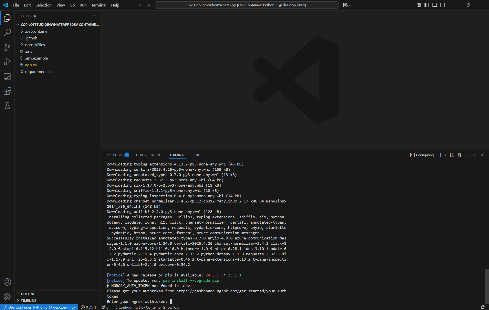

# CopilotStudioinWhatsApp

## Overview

**CopilotStudioinWhatsApp** is a Python-based backend application that acts as a bridge between WhatsApp (via Azure Communication Services) and a Microsoft Bot Framework bot (via DirectLine). It enables you to connect a WhatsApp number to a Copilot Studio (Power Virtual Agents) bot, allowing users to interact with your bot through WhatsApp messages. The project is designed for easy local development and testing, leveraging FastAPI, ngrok for secure tunneling, and robust configuration management.

---

## Project Components

### 1. `app.py`
- The main FastAPI application.
- Handles incoming webhook events from Azure Communication Services (ACS) for WhatsApp messages.
- Forwards messages to the Bot Framework via DirectLine, receives bot responses, and sends them back to WhatsApp via ACS.
- Contains all business logic for message handling, bot communication, and error management.

### 2. `requirements.txt`
- Lists all Python dependencies required to run the application, including FastAPI, httpx, websocket-client, Azure SDKs, and others.

### 3. `ngrockFiles/`
- **`run_ngrock.sh`**: Bash script to automate the setup and running of an ngrok tunnel for local development. It:
  - Ensures ngrok is installed and authenticated with your authtoken.
  - Prompts for the authtoken if not present in `.env` and updates both ngrok and your environment file.
  - Exposes your local FastAPI server to the internet and updates the callback URL in `.env`.
- **`install_ngrock.sh`**: Script to download and install ngrok if not already present.

### 4. `docs/images/`
- Contains documentation images, such as screenshots for setting up ngrok credentials.

### 5. `.env`
- Environment variable file (not included in the repo for security).
- Stores sensitive configuration such as DirectLine secrets, ACS connection strings, WhatsApp channel registration ID, ngrok authtoken, and callback URLs.

---

## Prerequisites

### 1. Ngrok for Local Testing
- **Why?**: ACS webhooks require a public HTTPS endpoint. Ngrok exposes your local FastAPI server to the internet securely.
- **Get your ngrok authtoken:**
  1. Sign up or log in at [ngrok.com](https://dashboard.ngrok.com/get-started/your-authtoken).
  2. Copy your personal authtoken.
  3. The `run_ngrock.sh` script will prompt for this token if not already set in `.env`.
  4. 

### 2. Azure Communication Services (ACS) & WhatsApp Channel
- **Set up an ACS resource** in the Azure Portal.
- **Configure a WhatsApp channel** by following the official Microsoft documentation: [Connect your WhatsApp Business Account to Azure Communication Services](https://learn.microsoft.com/en-us/azure/communication-services/quickstarts/advanced-messaging/whatsapp/connect-whatsapp-business-account)
- You will need:
  - `ACS_CONNECTION_STRING`: The connection string for your ACS resource.
  - `WHATSAPP_CHANNEL_ID`: The channel registration ID for your WhatsApp integration.

### 3. Microsoft Bot Framework (DirectLine)
- **Create a bot** in Azure Bot Services or Copilot Studio (Power Virtual Agents).
- **Enable DirectLine channel** and obtain:
  - `DIRECT_LINE_SECRET`: The DirectLine secret for your bot.
  - `DIRECTLINE_BASE_URL`: (Usually `https://europe.directline.botframework.com/v3/directline/`)

### 4. Webhook Configuration in ACS
- In the Azure Portal, configure your WhatsApp channel to send events (messages, delivery status, etc.) to your public webhook URL (provided by ngrok, e.g., `https://xxxx.ngrok.io/webhook/whatsapp`).
- The script will update `CALLBACK_URI_HOST` in `.env` automatically, but you must ensure ACS is configured to use this URL.

---

## Running the Project

### Using DevContainer (Recommended)

1. **Open the project in VS Code.**
2. **Reopen in Container** (if prompted, or via the Command Palette: `Dev Containers: Reopen in Container`).
3. **The DevContainer will automatically:**
   - Install all Python dependencies from `requirements.txt`.
   - Download and install ngrok if needed.
   - Run the ngrok setup and tunnel script (`ngrockFiles/run_ngrock.sh`).
   - Prompt you for your ngrok authtoken if not already set in `.env`.
   - Print your public URL and update `.env` accordingly.
4. **Start the FastAPI server (if not started automatically):**
   ```bash
   uvicorn app:app --reload --host 0.0.0.0 --port 8000
   ```
5. **Configure ACS webhook** to point to `https://<your-ngrok-domain>/webhook/whatsapp`.

### Running Locally Without DevContainer

> **Note:** If you do not use DevContainer, you must manually install dependencies and run the ngrok setup script.

1. **Install Python 3.10+** and `pip`.
2. **Install dependencies:**
   ```bash
   pip install -r requirements.txt
   ```
3. **Install ngrok:**
   - Download from [ngrok.com](https://ngrok.com/download) or let the script install it.
4. **Set up your `.env` file** with all required variables:
   - `DIRECTLINE_BASE_URL`, `DIRECT_LINE_SECRET`, `ACS_CONNECTION_STRING`, `WHATSAPP_CHANNEL_ID`, `NGROCK_AUTH_TOKEN`, `CALLBACK_URI_HOST`
5. **Start the FastAPI server:**
   ```bash
   uvicorn app:app --reload --host 0.0.0.0 --port 8000
   ```
6. **Run ngrok tunnel:**
   ```bash
   bash ngrockFiles/run_ngrock.sh
   ```
7. **Configure ACS webhook** as above.

---

## Environment Variables (`.env`)

| Variable                | Description                                                      |
|------------------------|------------------------------------------------------------------|
| DIRECTLINE_BASE_URL    | DirectLine API base URL (default: Europe endpoint)                |
| DIRECT_LINE_SECRET     | DirectLine secret for your bot                                    |
| ACS_CONNECTION_STRING  | Azure Communication Services connection string                    |
| WHATSAPP_CHANNEL_ID    | WhatsApp channel registration ID from ACS                         |
| NGROCK_AUTH_TOKEN      | Your ngrok authtoken                                              |
| CALLBACK_URI_HOST      | Public URL for webhook (set by ngrok script)                      |

---

## Example Payloads

### WhatsApp Message Event (from ACS to your webhook)
```json
[
  {
    "eventType": "Microsoft.Communication.AdvancedMessageReceived",
    "data": {
      "from": "whatsapp:+1234567890",
      "to": "whatsapp:+1098765432",
      "content": "Hello, bot!",
      "messageId": "abc123",
      "channelRegistrationId": "your-whatsapp-channel-id"
    }
  }
]
```

### Subscription Validation Event (from ACS/Event Grid)
```json
[
  {
    "eventType": "Microsoft.EventGrid.SubscriptionValidationEvent",
    "data": {
      "validationCode": "123456"
    }
  }
]
```

---

## Troubleshooting

- **ngrok not found:** The script will attempt to install it automatically.
- **ngrok authtoken issues:** Ensure your authtoken is correct and present in `.env`.
- **Webhook not receiving messages:**
  - Check that ACS is configured to use the correct public URL.
  - Ensure your FastAPI server is running and accessible.
- **Environment variable errors:** The app will raise clear errors if any required variable is missing.

---

## Security Notice
- Never commit your `.env` file or secrets to version control.
- Use secure storage for all credentials in production environments.

---

## License
This project is provided as-is for educational and integration purposes. Please review and adapt for your production needs.
